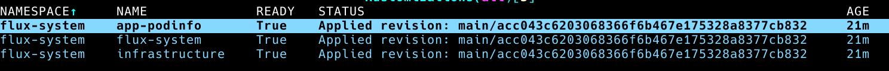

# Demo: Flux2 Health Checks & Dependencies

This demo is used to show the following features of Flux2:

* Health Checks
* Dependencies

The key takeaways of this demo are to show that these 2 features can be used to ensure that services are started in order in a predictable way.

## Setup

1. Fork the [flux-nonprod-clusters](https://github.com/kubecoins/flux-nonprod-clusters) repo.

2. [Create a GitHub Personal Access Token (pat)](https://docs.github.com/en/github/authenticating-to-github/creating-a-personal-access-token) with the **repo** scope.

3. Set the following environment variables:

```bash
export GITHUB_TOKEN=<your-pat>
export GITHUB_USER=<your-username>
```

4. Ensure the **apps/dev/backend-values.yaml** file contains the following and this is committed and pushed to your form:

```yaml
apiVersion: helm.toolkit.fluxcd.io/v2beta1
kind: HelmRelease
metadata:
  name: backend
  namespace: podinfo
spec:
  chart:
    spec:
      version: ">=1.0.0-alpha"
  test:
    enable: true
  values:
    faults:
      testFail: true
```

> This ensures the Helm tests are run and that the tests fail

## Demo Script

1. Open the cloned repo in VSCode or your favourite editor.

2. Open the following files and point out the import aspects which include (not exhaustive list):
    * **apps/base/podinfo/backend.yaml** - the __HelmRepository__ ref for the chart source and also that its going to act a gRPC server.
    * **apps/base/podinfo/frontend.yaml** - that this service __dependsOn__ the backend service and that it contains the URL for communicating with the backend service. 
    * **apps/dev/backend-values.yaml** - helm tests are enabled and set to fail. Also the chart version.
    * **clusters/dev/app1-podinfo.yaml** - it uses the kustomization from __./apps/dev__ and __dependsOn__ the infrastructure. There is also a __Health Check__ defined that will be used to determine if to report __Ready__. The health check will use the __frontend HelmRelease__.

> At this stage explain that we now have a dependency chain: **infrastructure<-Kustomization(app-podinfo)<-HelmRelease(frontend)<-HelmRelease(backend)**

3. Open 2 terminal windows (or terminal panes)

> The following steps will refer to a terminal window/pane using the following **(term1)** or **(term2)** and this window pane should be used.

3. **(term1)** Create a cluster to represent the `dev` environment using kind:

```bash
kind create cluster --name=kubecoins-dev
```

4. **(term1)** Check that Flux2 pre-reqs are met:

```bash
flux check --pre
```

5. **(term2)** Start [k9s](https://github.com/derailed/k9s) and show all pods

6. **(term1)** Bootstrap Flux2 using your cloned repo:

```bash
flux bootstrap github \
    --context=kind-kubecoins-dev \
    --owner=${GITHUB_USER} \
    --repository=flux-nonprod-clusters \
    --branch=main \
    --personal \
    --path=clusters/dev
```

7. **(term2)** Watch Flux2 controllers start up and wait until they are running.

> Explain about the Flux2 bootstrap process if needed

8. **(term2)** Watch the __infrastructure__ (nginx/redis) pods start up and wait until they are running.

9. **(term2)** Point out that the **backned-podinfo** pod is running but the **backend-podinfo-fault-test** pods have failed (these are the pods from the Helm test):


10. **(term2)** Change k9s to show the **kustomizations.kustomize.toolkit.fluxcd.io** instances (hit esq, enter crds, select the kustomizations crd):


> Explain that the kustomization isn't ready as its health check isn't passing and thats because the frontend HelmRelease isn't ready.

11. **(term2)** Change k9s to show the **helmrelease.kustomize.toolkit.fluxcd.io** instances (hit esq, select the helmreleases crd):


> Explain why the two HelmRelease for podinfo aren't ready. The **backend** isn't ready even though the pod is running as the helm test failed. And the **frontend** isn't ready as its dependency isn't ready.

12. We will now fix the solution. In your editor change **apps/dev/backend-values.yaml** so it is the same as this:

```yaml
apiVersion: helm.toolkit.fluxcd.io/v2beta1
kind: HelmRelease
metadata:
  name: backend
  namespace: podinfo
spec:
  chart:
    spec:
      version: ">=1.0.0-alpha"
  test:
    enable: false
```

13. **(term1)** Add, commit and push this change

14. **(term2)** In k9s watch the HelmReleases change state to **Ready**.


> Explain the first **backend** is ready as Helm test is no longer failing which means that **frontend**'s dependencies are met and it can them be applied and will become ready.

15. **(term2)** Change k9s to show the **kustomizations.kustomize.toolkit.fluxcd.io** instances (hit esq, select the kustomizations crd):



> Explain that the kustomization is now **Ready** because the Health Check which is passing. The health check is on the **frontend** HelmRelease.

16. **(term2)** Changes k9s to show all the pods (enter :, enter pods):


